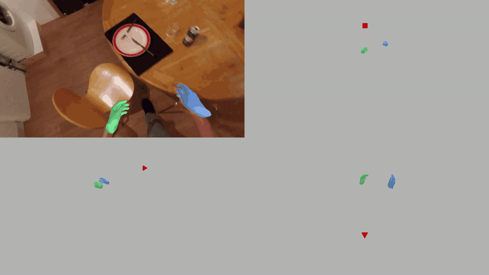

# EgoHandKit



**EgoHandKit** is a toolkit for hand mesh recovery and world-space
MANO reconstruction. It takes an image folder or video, detects hands, runs a
selected HMR backend, and renders camera-space hand overlays. VGGT-Omega camera
recovery and world-space MANO derivation are optional via `--omega_world`.

The project is centered on **`run.py`** and is designed for egocentric or
hand-centric videos where both image-space overlays and world-space hand
geometry are useful outputs.

Input can be either:

- an image folder, or
- a video file

External vision frontends additionally provide a validated
`egohand.observations.v1` pickle alongside that image/video input. This
canonical artifact is the only supported boundary for model-specific external
frontends; conversion and projection stay outside `run.py`.

The legacy pipeline has three default passes and an optional fourth:

1. **Detection** — YOLO hand detection, optionally merged with Detectron2 + ViTPose
2. **Cleaning** — temporal bbox cleanup and handedness correction
3. **Mesh Recovery** — run one backend: `hamer`, `htm`, `wilor`, or `hawor`
4. **Optional Omega World Derivation** — recover per-frame Omega cameras and derive MANO world-space results

`--frontend observations` replaces detection selection and cleaning with
all-person ViTPose candidates, same-frame consolidation and offline physical-hand
association. It preserves original bbox/keypoints/handedness and missing frames.
See [Observation Frontend](observation_frontend/README.md) for migration details,
limitations, caching and physical track ID semantics.

`--frontend canonical --observations <path>` bypasses EgoHandKit detection and
tracking entirely. All downstream stages consume the same canonical observation
schema regardless of whether the producer is MINT, ACE, an external MANO
pipeline, or another adapter. See [Pipeline Contract](PIPELINE_CONTRACT.md) for
the schema and validation rules.

## Prepare

Place third-party model weights and MANO assets under `_DATA/`. The loaders use
these relative paths as defaults, so keep the directory names unchanged.

Expected layout:

```text
_DATA/
├── data/
│   ├── mano/MANO_RIGHT.pkl
│   └── mano_mean_params.npz
├── hand_det/detector.pt
├── hamer_ckpts/
│   ├── model_config.yaml
│   └── checkpoints/
│       ├── hamer.ckpt
│       └── texture_supervised_hamer_weights.ckpt
├── hawor_ckpts/
│   ├── model_config.yaml
│   └── checkpoints/
│       ├── hawor.ckpt
│       └── infiller.pt
├── wilor_ckpts/
│   ├── model_config.yaml
│   └── wilor_final.ckpt
├── vggt_omega/
│   └── vggt_omega_1b_512.pt
└── vitpose_ckpts/
    ├── configs/ViTPose_huge_wholebody_256x192.py
    └── vitpose+_huge/wholebody.pth
```

Asset sources:

| Asset | Required for | Source |
|---|---|---|
| `data/mano/MANO_RIGHT.pkl` | all HMR backends | [MANO](https://mano.is.tue.mpg.de/) |
| `data/mano_mean_params.npz` | all HMR backends | [HaMeR demo assets](https://github.com/geopavlakos/hamer) |
| `hand_det/detector.pt` | default YOLO hand detection | [WiLoR](https://github.com/rolpotamias/WiLoR) |
| `hamer_ckpts/checkpoints/hamer.ckpt` + `hamer_ckpts/model_config.yaml` | `--backend hamer` | [HaMeR](https://github.com/geopavlakos/hamer) |
| `hamer_ckpts/checkpoints/texture_supervised_hamer_weights.ckpt` | `--backend htm` | [Hand Texture Module](https://github.com/gkarv/Hand-Texture-Module) |
| `wilor_ckpts/wilor_final.ckpt` + `wilor_ckpts/model_config.yaml` | `--backend wilor` | [WiLoR](https://github.com/rolpotamias/WiLoR) |
| `hawor_ckpts/checkpoints/hawor.ckpt` + `hawor_ckpts/checkpoints/infiller.pt` + `hawor_ckpts/model_config.yaml` | `--backend hawor` | [HaWoR](https://github.com/ThunderVVV/HaWoR/) |
| `vggt_omega/vggt_omega_1b_512.pt` | optional `--omega_world` | [VGGT-Omega](https://github.com/facebookresearch/vggt-omega) |
| `vitpose_ckpts/configs/ViTPose_huge_wholebody_256x192.py` + `vitpose_ckpts/vitpose+_huge/wholebody.pth` | `--use_vitpose` or `--frontend observations` | [ViTPose](https://github.com/ViTAE-Transformer/ViTPose) |

## Installation

The pip requirements are collected in `requirements.txt`, recommended setup:

```bash
conda create -n egohandkit python=3.10 -y
conda activate egohandkit
python -m pip install pip==25.3 setuptools==69.5.1 wheel==0.45.1 Cython==0.29.37
python -m pip install numpy==1.26.1 scipy==1.14.1 ninja==1.11.1.4
python -m pip install torch==2.7.1 torchvision==0.22.1 --index-url https://download.pytorch.org/whl/cu128
python -m pip install --no-build-isolation -r requirements.txt
```

Notes:

- Install PyTorch and the build prerequisites first: Detectron2 imports PyTorch
  during its build, and the legacy packages need the existing environment.
- See [ENVIRONMENT.md](ENVIRONMENT.md) for this machine's verified CUDA 12.6
  setup, activation commands, asset locations, and validation results.
- `requirements.txt` defaults to the CUDA 12.8 PyTorch wheel index
  (`torch==2.7.1`, `torchvision==0.22.1`). If your CUDA version is different,
  install the matching PyTorch stack first or adjust the PyTorch lines in
  `requirements.txt`.
- `--use_vitpose` requires the Detectron2 + ViTPose stack. These packages are
  included in `requirements.txt`, but Detectron2 may need to be rebuilt for your
  local CUDA/PyTorch combination.

## Quick Start

```bash
# Image folder input
python run.py --input test_data/images/disk --backend hawor --gpu 0

# Video file input (frames are auto-extracted)
python run.py --input assets/disk.mp4 --backend wilor --gpu 0

# Dataset video input (session + camera are included in the cache/output name)
python run.py --input /path/to/session/videos/left.mp4 --backend hawor --gpu 0

# Enable YOLO + Detectron2 + ViTPose merge
python run.py --input test_data/images/disk --backend hamer --use_vitpose

# All-person observation selection; no legacy bbox interpolation or label repair
python run.py --input test_data/images/disk --frontend observations --backend hawor --gpu 0

# External frontend through the canonical observation boundary
python run.py --input assets/disk.mp4 --frontend canonical \
  --observations /path/to/disk.observations.pkl --backend hamer --gpu 0

# Explicitly enable the optional camera/world branch
python run.py --input test_data/images/disk --backend hawor --omega_world --gpu 0

# Switch backend while reusing cached Pass 1 / Pass 2 results
python run.py --input assets/disk.mp4 --backend htm --gpu 0

# Force re-run detection / cleaning
python run.py --input test_data/images/disk --backend hawor --force_detect

```

## Main Options

| Argument | Default | Description |
|---|---|---|
| `--input` | required | Video file or image folder |
| `--sequence_name` | auto | Override the sequence name used for frame caches and outputs; dataset videos default to `{session}_{camera}` to avoid collisions such as multiple `left.mp4` files |
| `--backend` | `hawor` | `hamer`, `htm`, `wilor`, `hawor` |
| `--frontend` | `legacy` | `legacy`, offline ViTPose `observations`, or external `canonical`; every mode uses an isolated output directory |
| `--observations` | - | `egohand.observations.v1` pickle; required only with `--frontend canonical` |
| `--output_root` | `test_data/hand_proc` | Root directory for run outputs |
| `--depth_gate` / `--depth_dir` | disabled | Apply the generic depth veto before HMR; `depth_dir` is the export root containing `fast_foundation/depth_uint16_png` |
| `--motion_gate` | disabled | Apply the image-space motion veto before HMR |
| `--yolo_check` | disabled | Deprecated backward-compatible YOLO diagnostic; never validates hand presence or changes HMR input |
| `--mint_depth_wrist_only` | disabled | Make the depth gate compare MINT joint-0 depth only with sensor depth |
| `--mint_depth_sensor_anchor` | disabled | Use dataset wrist depth; reject above `--depth_max_m` (production: 1m); unavailable depth keeps frontend 3D without sensor calibration |
| `--mint_depth_wrist_threshold_m` | `0.08` | Maximum absolute MINT/sensor wrist-depth difference |
| `--mint_3d_consistency_gate` | disabled | Reject HMR samples inconsistent with available MINT camera-space joints before smoothing |
| `--hmr_primary_policy` | disabled | Within the consistency stage, only sustained severe errors against sensor-supported MINT veto HMR; enabled in the production script |
| `--hmr_severe_wrist_distance_m` / `--hmr_severe_vector_angle_deg` | `0.15` / `80` | Severe wrist position / palm-vector discrepancy; scale remains diagnostic in HMR-first mode |
| `--hmr_error_confirm_frames` | `3` | Consecutive severe frames required within one track fragment; `1` disables confirmation |
| `--hmr_reference_depth_tolerance_m` | `0.08` | Maximum spread of at least three MINT MCP-derived wrist depths and their disagreement with measured wrist depth |
| `--hmr_stable_wrist_anchor` | disabled | Partial recovery preserves the HMR wrist image ray, prioritizes visible MCP sensor depth and borrows only MINT Z; production enabled |
| `--hmr_duplicate_hand_gate` | disabled | Remove wrong-side duplicate with reliable separated MINT references; otherwise pair checks are diagnostic |
| `--hmr_duplicate_distance_m` / `--hmr_reference_separation_m` / `--hmr_assignment_margin_m` | `0.06` / `0.15` / `0.08` | HMR overlap, minimum frontend separation, and nearest-reference assignment margin, in metres |
| `--mint_wrist_distance_max_m` | `0.08` | Maximum MINT/HMR wrist distance |
| `--mint_wrist_vector_angle_max_deg` | `40` | Maximum wrist-to-palm vector angle |
| `--mint_hand_scale_min` / `--mint_hand_scale_max` | `0.7` / `1.3` | Allowed HMR/MINT hand-scale ratio |
| `--hand_tracking_parquet` | disabled | Write `final/hand_tracking.parquet` with fixed-size camera-space joint arrays |
| `--endpoint_wrist_gate` | disabled | Reject extreme raw wrist rotations only at track-fragment endpoints |
| `--temporal_smoother` | disabled | Smooth camera-space MANO output after the endpoint gate |
| `--final_joints_smoother` | disabled | Smooth selected HMR/MINT camera joints before Parquet export; production script uses this instead of HMR-only smoothing |
| `--hmr_partial_hand_recovery` | disabled | Attempt HMR on visible partial hands and retain its shape with sensor/MINT wrist assistance; enabled in the production script |
| `--hmr_partial_min_visible_joints` | `4` | Minimum in-frame canonical joints required to attempt HMR on frontend fallback hands |
| `--hmr_partial_depth_spread_max_m` | `0.08` | Maximum spread of wrist-depth estimates from at least three visible MCP samples |
| `--final_smoother_max_jump_m` | `0.2` | Restart final smoothing when any joint jumps farther between frames; does not delete hands |
| `--gpu` | `0` | Physical CUDA GPU index. Sets both `CUDA_VISIBLE_DEVICES` and `EGL_DEVICE_ID` before importing torch, then the process uses remapped `cuda:0`. |
| `--fps` | `15` | Output FPS for image-folder input |
| `--render` | `True` | Render mesh overlays |
| `--render_frontend_fallback` | `False` | Optional legacy orange fallback skeletons; mutually exclusive with Parquet mesh rendering |
| `--render_hand_tracking_parquet` | `False` | Fit uniform MANO meshes to final Parquet joints; enables export; production script default |
| `--parquet_mano_fit_steps` | `200` | Independent per-hand MANO fitting iterations for visualization |
| `--parquet_mano_fit_max_rmse_m` | `0.03` | Maximum joint fit RMSE for rendering; failures recorded in `final/parquet_mesh_fit.json` |
| `--force_detect` | `False` | Re-run Pass 1 / Pass 2 even if cache exists |
| `--no_clean_bbox` | `False` | Skip Pass 2 temporal bbox cleaning and feed raw Pass 1 detections to Pass 3 |
| `--use_vitpose` | `False` | Merge YOLO with Detectron2 + ViTPose detections |
| `--batch_size` | `48` | Cross-frame crop batch size for hamer/htm/wilor; HaWoR uses its own 16-frame inference windows |
| `--rescale_factor` | auto | Bbox padding factor |
| `--img_focal` | auto | HaWoR focal in image pixels: CLI -> `est_focal.txt` beside the input frames -> `600` |
| `--omega_world` | `False` | Enable optional Pass 4 camera recovery + world-space MANO derivation |
| `--no_omega_world` | - | Explicitly keep Omega disabled; retained for compatibility |
| `--omega_checkpoint` | `_DATA/vggt_omega/vggt_omega_1b_512.pt` | Omega checkpoint path |
| `--omega_image_resolution` | `512` | Omega preprocessing image resolution |
| `--omega_chunk_size` | `auto` | Omega chunk size for long videos |
| `--omega_overlap` | `8` | Overlap frames for Omega chunk alignment |
| `--omega_force` | `False` | Re-run Omega camera recovery even if cache exists |
| `--no_omega_world_vis` | `False` | Disable default Omega world fixed-view 2x2 visualization |

## Key Current Behavior

- **Backend names are unified**: only `hamer`, `htm`, `wilor`, `hawor`
- **GPU control is unified** through `run.py --gpu`, by setting `CUDA_VISIBLE_DEVICES` + `EGL_DEVICE_ID` before importing torch, then using remapped `cuda:0` inside the process
- **Pass 3 batching for hamer/htm/wilor is sequence-level**: hand crops across the sequence are batched together (up to `--batch_size`), not per-image
- **HaWoR uses its own runner** and focal resolution path
- **Pass 2 can be bypassed** with `--no_clean_bbox`; Pass 3 then consumes raw Pass 1 detections directly
- **Hand overlays are the default**: Pass 4 runs only with `--omega_world`; otherwise no Omega model is loaded and no new camera/world files are generated

## Input / Output

### Input

- **Video file**: `.mp4`, `.avi`, `.mov`, `.mkv`, `.webm`
  - frames are extracted to `test_data/images/{name}/`; videos under a `videos/` directory use `{session}_{camera}` as `{name}`
  - output video uses the source video's native FPS
- **Image folder**
  - images are loaded directly
  - output video uses `--fps`

### Output

Outputs are written to:

```text
test_data/hand_proc/{name}/
```

Typical legacy contents (Omega files appear only with `--omega_world`):

```text
pass1_raw.pkl
pass2_cleaned.pkl
{name}_{backend}.pkl
omega_camera.npz
{name}_{backend}_omega_world.pkl
render_{backend}/
render_{backend}.mp4
omega_world_grid_{backend}/
omega_world_grid_{backend}.mp4
```

## Caching

Non-legacy modes use `test_data/hand_proc/{name}_{frontend}/`. Observation mode
contains
`observations_raw.pkl`, `observations_selected.pkl` and an inspectable
`observation_selection.json`. Its signature guards against stale input, model
configuration and selector code. Legacy results are not overwritten.

Canonical mode writes the remapped, validated input to
`stages/00_frontend/observations.pkl`, stage reports below `stages/`, and the
versioned `egohand.results.v1` payload to `final/results.pkl`. The loader matches
the artifact to the current frame count, order, resolution and FPS, then remaps
its image paths by stable `frame_idx`.

When enabled, the 3D gate writes
`stages/45_mint_3d_consistency/mint_3d_consistency.json`. Rejected backend
samples do not enter the endpoint gate or smoother. Parquet export prefers the
accepted HMR joints and falls back to the canonical MINT joints when HMR is
missing or rejected. Both MINT and HMR joints are first anchored to registered
sensor depth at their respective projected wrist pixels; HaMeR's virtual
camera translation is not used as metric depth. When
`fast_foundation_stereo_video_meta.json` is present under the depth root, its
calibrated RGB intrinsics are used for back-projection; canonical/MINT
intrinsics are only a compatibility fallback.
If no valid sensor depth exists around a MINT wrist, that hand remains in the
canonical stage diagnostics but is not emitted as metric 3D in Parquet.

## External MANO Conversion

`tools/convert_external_mano_to_canonical.py` converts the structured
`front_output` MANO arrays into canonical observations by reconstructing and
projecting 21 joints. The parameter file and image/video must be from the same
camera:

```bash
python tools/convert_external_mano_to_canonical.py \
  --front-output /path/to/front_output \
  --parameter /path/to/front_output/sequences/session/left.npy \
  --video /path/to/session/videos/left_rectified.mp4 \
  --output /path/to/left_observations.pkl \
  --sequence-name session_left_rectified
```

After EgoHandKit renders the canonical run, the reusable
`scripts/render_external_mano_comparisons.sh` script renders the source MANO
predictions and creates labeled, side-by-side videos. Its dataset paths,
backend, cameras, render environment and comparison height are configurable
through the environment variables documented at the top of the script.

Legacy Pass 1 and Pass 2 are cached:

- switching `--backend` normally only re-runs Pass 3 and the backend-specific world pkl
- `omega_camera.npz` is reused across backends unless `--omega_force` is set
- use `--force_detect` to invalidate detection / cleaning cache
- use `--no_clean_bbox` to ignore `pass2_cleaned.pkl` and skip writing a new Pass 2 cache for that run

## Pass 2 Cleaning Summary

The cleaning stage includes:

- overlap removal
- handedness swap correction
- temporal consistency repair
- interpolation over short gaps
- removal of short spurious tracks
- overlap re-check after interpolation

For implementation details, refer to `bbox_utils.py`.

## Project Structure

```text
run.py                  # Main entry point
mesh_recovery.py        # Pass 3 orchestration
bbox_utils.py           # Pass 1 / Pass 2 logic
vitpose_model.py        # Optional ViTPose wrapper
hmr_backends/           # Models, datasets, runners, rendering utilities
  datasets/vitdet_dataset.py   # ViTDetDataset (per-image) + SequenceVitDetDataset (whole-sequence)
  omega/                       # Migrated Omega runtime + Pass 4 camera/world utilities
  runners/batch_runner.py      # Sequence-level batched inference for hamer/htm/wilor
  runners/hawor_runner.py      # Segment-based inference for hawor
```

## Rendering

- **Left hand**: green
- **Right hand**: blue
- Lighting: ambient + 3 Raymond DirectionalLights (PointLights removed for cross-backend brightness consistency)
- **Omega world grid**: default 2x2 video. Top-left is the original overlay; the other three tiles are fixed world-space front / right / top views on a gray background with the current Omega camera shown as a red pyramid.


## Acknowledgement

This work is built on many amazing research works and open-source projects:

- [Dyn-HaMR](https://github.com/ZhengdiYu/Dyn-HaMR)
- [HaMeR](https://github.com/geopavlakos/hamer)
- [HaWoR](https://github.com/ThunderVVV/HaWoR)
- [WiLoR](https://github.com/rolpotamias/WiLoR)
- [VGGT-Omega](https://github.com/facebookresearch/vggt-omega)

Thanks for their excellent works and great contribution.

## Citation

If you find this project useful, please cite:

```bibtex
@misc{wu2026egohandkit,
    title     = {EgoHandKit},
    author    = {Wu, Zijian},
    url       = {https://github.com/Zijian-Wu/EgoHandKit},
    year      = {2026}
}
```
